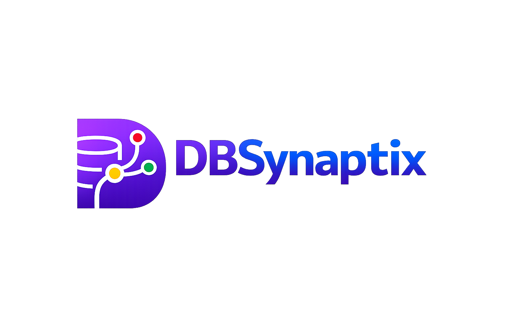

<p align="center">
  
</p>

<p align="center">
  <strong>Giving Data a Brain.</strong>
</p>

<p align="center">
  Retrieval-driven Text-to-SQL for PostgreSQL with semantic schema understanding,
  relationship-aware context construction, SQL validation, execution, and repair.
</p>

---

## What is DBSynaptix?

DBSynaptix is an AI-powered database intelligence system that turns natural-language questions into executable PostgreSQL queries.

Instead of sending an entire database schema to an LLM for every question, DBSynaptix builds a persistent semantic representation of the database and retrieves only the schema context relevant to the user's query.

The query pipeline combines **keyword matching and semantic similarity**, expands retrieved tables through **foreign-key relationships**, generates SQL with Gemini, validates and executes the query, and can perform **one controlled repair attempt** when execution fails.

The result is a retrieval-first Text-to-SQL architecture designed to keep LLM generation grounded in relevant database structure while exposing latency, token usage, and repair behaviour across the pipeline.

### Retrieval benchmark

Evaluated on **20 natural-language questions against the 14-table Northwind schema**:

| Metric | Result |
| --- | ---: |
| Retrieval Recall@3 | **85.92%** |
| Context Recall | **97.33%** |
| Schema Context Used | **46.43%** |
| Perfect Retrieval Cases | **13 / 20** |
| Perfect Context Cases | **18 / 20** |

These are **schema retrieval and context-construction metrics**, not SQL-generation accuracy. End-to-end SQL execution/correctness is evaluated separately.

---

## Core Capabilities

- PostgreSQL schema and metadata extraction
- Primary-key and foreign-key relationship discovery
- AI-generated semantic knowledge for database tables
- Persistent schema indexing with Gemini embeddings
- Hybrid schema retrieval using keyword and semantic scoring
- Foreign-key-aware context expansion for multi-table queries
- Context-grounded natural-language-to-SQL generation
- SQL validation before execution
- PostgreSQL query execution
- Execution-error-aware SQL repair with one controlled retry
- Query latency and token usage observability
- Interactive schema explorer and natural-language query workspace
- Retrieval benchmark dashboard
- Northwind retrieval and end-to-end evaluation framework

---

## Architecture

DBSynaptix separates expensive database understanding and indexing from the query-time Text-to-SQL pipeline.

### 1. Database Indexing Pipeline

```text
PostgreSQL Database
        |
        v
Schema Extraction
        |
        v
Semantic Knowledge Generation
        |
        v
Retrieval Document Building
        |
        v
Gemini Embeddings
        |
        v
Persistent Semantic Index
```

When a database is indexed, DBSynaptix extracts tables, columns, primary keys, and foreign-key relationships. The schema is enriched with semantic knowledge and converted into retrieval documents with embeddings.

The completed index is persisted so this work does not need to be repeated for every natural-language query.

### 2. Query-Time Pipeline

```text
Natural-Language Question
          |
          v
    Query Preprocessing
          |
          v
      Hybrid Retrieval
   Keyword 40% + Semantic 60%
          |
          v
 Relationship-Aware Expansion
          |
          v
      Focused Context
          |
          v
       Prompt Builder
          |
          v
          Gemini
          |
          v
      SQL Validation
          |
          v
       SQL Execution
          |
     +----+----+
     |         |
  Success    Error
     |         |
     |         v
     |     SQL Repair
     |         |
     |    One Retry
     |         |
     +----+----+
          |
          v
 Results + Pipeline Metadata
```

At query time, DBSynaptix embeds the user's question and ranks indexed schema documents using hybrid retrieval. Retrieved tables are expanded through foreign-key relationships when additional schema context is required for joins.

Only the resulting focused context is sent to Gemini for SQL generation.

Generated SQL is validated and executed against PostgreSQL. If PostgreSQL returns an execution error, the failed SQL, database error, question, and schema context are supplied to the repair pipeline for **one controlled retry**.

The pipeline also records retrieval, context construction, generation, execution, and total latency together with token usage and repair metadata.

---

## Retrieval Strategy

DBSynaptix uses **hybrid retrieval** instead of relying entirely on either lexical matching or embeddings.

For every indexed table, the retrieval engine combines:

- **Keyword score (40%)** — matches query keywords against table and column names.
- **Semantic score (60%)** — measures cosine similarity between the question embedding and the table's indexed embedding.

```text
Question
   |
   +---- Keyword Matching ---- 40%
   |
   +---- Semantic Similarity -- 60%
   |
   v
Hybrid Ranking
   |
   v
Top-K Candidate Tables
   |
   v
Foreign-Key Expansion
   |
   v
Focused Schema Context
```

Retrieval alone may identify the main entity in a question while missing intermediate tables required for a join. The context builder therefore uses the database's foreign-key graph to expand the selected tables with relevant relationships before SQL generation.

This separates two responsibilities:

**Retrieval finds what is semantically relevant.**
**Context construction finds what is relationally necessary.**

On the current Northwind benchmark, this raises average coverage from **85.92% Retrieval Recall@3** to **97.33% Context Recall**, while the resulting context contains **46.43% of the full schema on average**.

These metrics measure schema selection and should not be interpreted as SQL-generation accuracy.

---

## Tech Stack

### Backend

- **Python 3**
- **FastAPI** — API and application routing
- **PostgreSQL** — target relational database
- **Psycopg** — PostgreSQL connectivity and query execution
- **Pydantic** — request and response validation

### AI & Retrieval

- **Google Gemini** — SQL generation, semantic knowledge generation, and repair
- **Gemini Embeddings** — semantic schema representation
- **Cosine Similarity** — semantic retrieval scoring
- **Hybrid Retrieval** — keyword scoring + embedding similarity
- **Foreign-Key Graph Expansion** — relationship-aware context construction

### Frontend

- **Next.js**
- **React**
- **TypeScript**
- **Tailwind CSS**

The frontend provides the product landing page, PostgreSQL connection flow, schema explorer, natural-language query workspace, SQL/results inspection, pipeline metadata, and benchmark dashboard.

### Evaluation

- **Northwind PostgreSQL dataset**
- Custom retrieval/context benchmark runner
- End-to-end SQL execution and correctness evaluation
- Per-difficulty and per-category retrieval analysis
- Latency and token usage instrumentation

---

## Project Structure

```text
dbsynaptix/
|
|-- app/
|   |-- ai/              # AI provider, preprocessing and hybrid retrieval
|   |-- context/         # Relationship-aware context construction
|   |-- database/        # PostgreSQL connection and metadata extraction
|   |-- indexing/        # Retrieval documents, embeddings and index storage
|   |-- knowledge/       # Semantic schema knowledge generation
|   |-- models/          # Internal data models
|   |-- routers/         # FastAPI API routes
|   |-- schemas/         # Request and response models
|   |-- services/        # Application and pipeline orchestration
|   `-- sql/             # Prompting, validation, execution and SQL repair
|
|-- data/
|   `-- indexes/         # Persisted semantic database indexes
|
|-- evaluation/
|   |-- questions.json   # Northwind benchmark questions
|   |-- evaluator.py     # Retrieval and context evaluation
|   |-- summarize.py     # Benchmark aggregation
|   |-- results.json     # Per-question retrieval results
|   |-- summary.json     # Aggregated retrieval metrics
|   |-- e2e_evaluator.py # End-to-end SQL evaluation
|   `-- e2e_results.json # End-to-end evaluation results
|
|-- frontend/
|   |-- app/
|   |   |-- benchmarks/  # Benchmark dashboard
|   |   |-- connect/     # PostgreSQL connection flow
|   |   |-- workspace/   # Schema explorer and query workspace
|   |   `-- page.tsx     # Product landing page
|   `-- public/          # DBSynaptix branding assets
|
|-- tests/               # Backend component and pipeline tests
|-- .env.example
|-- requirements.txt
`-- README.md
```

---

## Getting Started

### 1. Clone the repository

```bash
git clone https://github.com/Yashasvi-14/DBSynaptix.git
cd DBSynaptix
```

### 2. Set up the backend

Create a Python virtual environment:

```bash
python -m venv .venv
```

Activate it on Windows:

```powershell
.venv\Scripts\Activate.ps1
```

Install the dependencies:

```bash
pip install -r requirements.txt
```

### 3. Configure environment variables

Create `.env` from `.env.example` and provide the required Gemini configuration.

```env
GEMINI_API_KEY=YOUR_GEMINI_API_KEY
```

PostgreSQL connection credentials are supplied through the DBSynaptix connection flow rather than stored as application-level database credentials.

### 4. Start the backend

From the repository root:

```bash
uvicorn app.main:app --reload
```

The FastAPI backend will run locally on port `8000` by default.

### 5. Set up the frontend

Open another terminal:

```bash
cd frontend
npm install
```

Create:

```text
frontend/.env.local
```

with:

```env
NEXT_PUBLIC_API_URL=http://localhost:8000
```

Start the Next.js development server:

```bash
npm run dev
```

Then open the local URL shown by Next.js, typically `http://localhost:3000`.

### 6. Use DBSynaptix

From the application:

1. Connect a PostgreSQL database.
2. Allow DBSynaptix to extract and index its schema.
3. Open the query workspace.
4. Ask a question in natural language.
5. Inspect the generated SQL, query results, token usage, latency, and repair metadata.

---

## Benchmarking

DBSynaptix includes a reproducible evaluation pipeline built around the **14-table Northwind PostgreSQL schema**.

The retrieval benchmark contains **20 natural-language questions** across four difficulty levels:

- **Easy** — single-table retrieval
- **Medium** — aggregation queries
- **Hard** — multi-table queries
- **Complex** — relationship-heavy queries

Each benchmark question defines the schema tables required to answer it. DBSynaptix runs the normal retrieval and context-construction pipeline and compares the selected tables against that expected set.

### Current Retrieval Results

| Metric | Result |
| --- | ---: |
| Questions | **20** |
| Retrieval Recall@3 | **85.92%** |
| Context Recall | **97.33%** |
| Average Schema Context Used | **46.43%** |
| Context Precision | **36.63%** |
| Perfect Retrieval Cases | **13 / 20** |
| Perfect Context Cases | **18 / 20** |

### Results by Difficulty

| Difficulty | Retrieval Recall | Context Recall | Context Used |
| --- | ---: | ---: | ---: |
| Easy | 100.00% | 100.00% | 40.00% |
| Medium | 100.00% | 100.00% | 51.43% |
| Hard | 73.33% | 93.33% | 51.43% |
| Complex | 70.33% | 96.00% | 42.86% |

The benchmark demonstrates an important distinction between **retrieval** and **context construction**: the initial top-ranked tables do not always contain every table required for complex joins, while relationship-aware expansion can recover additional required schema.

### Run the Retrieval Benchmark

From the repository root:

```bash
python -m evaluation.evaluator
python -m evaluation.summarize
```

Per-question results are written to:

```text
evaluation/results.json
```

and aggregated metrics to:

```text
evaluation/summary.json
```

DBSynaptix also includes a separate end-to-end evaluator for queries with ground-truth SQL:

```bash
python -m evaluation.e2e_evaluator
```

Retrieval/context metrics are intentionally reported separately from SQL correctness. **97.33% Context Recall does not mean 97.33% SQL accuracy.**

---

## Current Status

### Implemented

- PostgreSQL connection and schema extraction
- Primary-key and foreign-key discovery
- AI-generated semantic schema knowledge
- Persistent semantic index generation
- Gemini embeddings
- Hybrid keyword + semantic retrieval
- Relationship-aware context construction
- Context-grounded SQL generation
- SQL validation and PostgreSQL execution
- Execution-error-aware SQL repair with one controlled retry
- Token usage and pipeline latency instrumentation
- Interactive database connection flow
- Schema explorer
- Natural-language query workspace
- Generated SQL and result inspection
- Retrieval benchmark and benchmark dashboard
- End-to-end SQL evaluation framework
- DBSynaptix product landing page

### Current Scope

DBSynaptix currently targets **PostgreSQL** and uses the Northwind database for reproducible evaluation.

The current evaluation suite is intentionally small and designed to validate the architecture rather than claim production-level Text-to-SQL performance. Retrieval performance is measured across 20 benchmark questions, while SQL correctness is evaluated separately on questions with defined ground-truth SQL.

### Future Work

- Larger and more diverse Text-to-SQL evaluation suites
- Improved context precision for simple queries
- Adaptive retrieval and context-expansion strategies
- Expanded end-to-end SQL correctness evaluation
- Multi-database engine support
- Production authentication and credential management

---

## Design Philosophy

A Text-to-SQL system should not require an LLM to reason over every table in a database for every question.

DBSynaptix follows a retrieval-first architecture:

```text
Understand the database
        |
        v
Retrieve relevant schema
        |
        v
Expand required relationships
        |
        v
Build focused context
        |
        v
Generate and validate SQL
        |
        v
Execute, observe, and repair